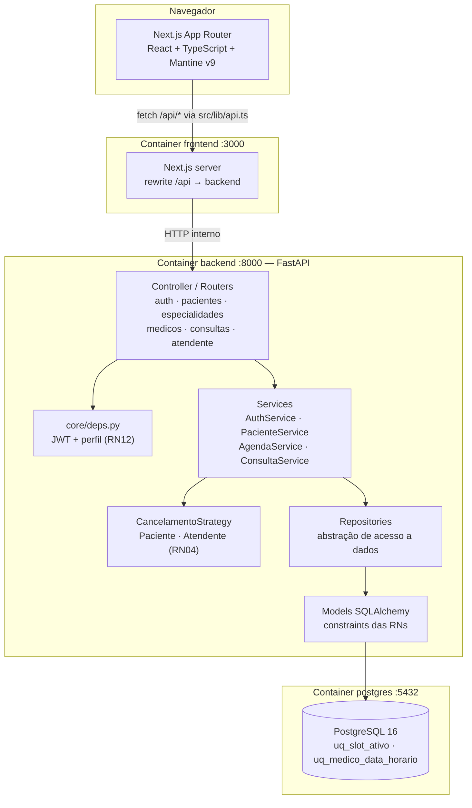

# Arquitetura

## 1. Estilo arquitetural escolhido

**Monólito modular em camadas (MVC)**, com backend e frontend no mesmo repositório
(monorepo) mas em processos separados.

O Módulo 4 do curso apresenta monolito, monolito modular, hexagonal e microsserviços.
Para uma equipe de 6 pessoas, 2 semanas de prazo e um domínio pequeno e bem definido,
o próprio material é explícito: *"em contextos ágeis, especialmente em equipes menores ou
projetos em fase inicial, a arquitetura monolítica pode acelerar o desenvolvimento, pois
reduz a complexidade técnica e operacional"*. Microsserviços aqui seriam complexidade
acidental — vários deploys, mensageria e consistência distribuída para resolver um problema
que cabe em um banco.

O que tomamos emprestado do hexagonal, sem pagar o custo dele: as regras de negócio
(**Service**) não conhecem nem HTTP nem SQL. Elas dependem de abstrações (**Repository**),
o que já dá testabilidade e baixo acoplamento.

## 2. Como o MVC se mapeia neste projeto

O MVC clássico nasceu para aplicações onde a View é renderizada pelo servidor. Aqui a View
é um app Next.js separado, então o mapeamento é:

| Camada MVC | Onde vive | Responsabilidade |
|---|---|---|
| **View** | `frontend/src/app/`, `frontend/src/components/` | Apresentação e interação. Zero regra de negócio. |
| **Controller** | `backend/app/routers/` | Recebe requisição, autoriza por perfil, chama **um** service, commita, serializa a resposta. |
| **Model** | `backend/app/models/` | Entidades SQLAlchemy, relacionamentos e constraints que materializam as RNs no banco. |

Duas camadas de apoio, que o Módulo 4 trata em "definição de padrões":

| Camada extra | Onde vive | Por que existe |
|---|---|---|
| **Service** | `backend/app/services/` | Concentra a regra de negócio. Sem ela, a regra vaza para o Controller (o clássico "fat controller") ou para o Model. |
| **Repository** | `backend/app/repositories/` | Isola o acesso a dados. É o que permite testar Service sem banco. Ver `docs/06-design-patterns.md`. |

E os **Schemas** (`backend/app/schemas/`) são DTOs Pydantic: separam o contrato público da
API da estrutura interna das tabelas. Trocar uma coluna não quebra o cliente
automaticamente, e o cliente não recebe `senha_hash` por acidente.

## 3. Visão de componentes



## 4. Regra de dependência

O sentido das setas é **sempre para dentro**. Nenhuma camada conhece quem a chama.

```
Router  ──▶  Service  ──▶  Repository  ──▶  Model  ──▶  PostgreSQL
   │            │
   │            └── depende de RepositorioBase (abstração), não de Session  ← DIP
   │
   └── traduz exceção de domínio em HTTP (via handler registrado)
```

Proibições que tornam isso verificável por `grep`:

| Proibição | Verificação |
|---|---|
| Service não importa `fastapi` nem `HTTPException` | `grep -r "fastapi\|HTTPException" backend/app/services/` |
| Service não monta query | `grep -r "select(" backend/app/services/` |
| Router não decide regra de negócio | revisão de PR (checklist) |
| Repository não faz `commit()` | `grep -r "\.commit()" backend/app/repositories/` |

O `commit()` é responsabilidade do Router: uma requisição = uma transação. O Repository faz
apenas `flush()`, o que garante que o objeto ganhe `id` sem encerrar a transação — assim uma
regra que falha depois de um `salvar()` desfaz tudo.

## 5. Como um erro de negócio se propaga

```
PacienteService._garantir_cpf_inedito()
        │  raise CpfDuplicado          (status_code = 409, mensagem pronta)
        ▼
exceptions/handlers.py  @app.exception_handler(RegraDeNegocioViolada)
        │
        ▼
HTTP 409  { "detail": "CPF ja cadastrado", "erro": "CpfDuplicado" }
        │
        ▼
frontend/src/lib/api.ts  →  throw new ApiError("CPF ja cadastrado", 409)
        │
        ▼
notifications.show({ message: erro.message, color: 'red' })
```

O Service nunca soube que existia HTTP. O componente React nunca soube que existia SQL.
Cada exceção de domínio carrega o próprio `status_code`, então adicionar uma regra nova não
exige tocar em nenhum router.

## 6. Estrutura de diretórios

```
.
├── CLAUDE.md                       # instruções para agentes de IA
├── Makefile                        # atalhos (bootstrap, test, lint, seed)
├── docker-compose.yml              # postgres + backend + frontend
├── .env.example                    # copiar-e-rodar
│
├── backend/
│   ├── Dockerfile                  # multi-stage (base → deps → runtime)
│   ├── pyproject.toml              # deps, pytest, ruff, coverage
│   ├── alembic/                    # migrações versionadas
│   └── app/
│       ├── main.py                 # CORS, handlers, routers, /health
│       ├── core/
│       │   ├── config.py           # Settings (12-factor)
│       │   ├── database.py         # engine, SessionLocal, Base, get_db
│       │   ├── security.py         # bcrypt (RN11) + JWT (RN13)
│       │   └── deps.py             # usuario_atual, exigir_atendente/paciente (RN12)
│       ├── models/                 # ── MODEL ──
│       │   ├── enums.py            # StatusConsulta, TRANSICOES_PERMITIDAS (RN06/RN10)
│       │   ├── usuario.py  paciente.py  medico.py
│       │   ├── especialidade.py  horario_disponivel.py  consulta.py
│       ├── schemas/                # DTOs Pydantic (RN07, RN08, RN09)
│       ├── repositories/           # ── REPOSITORY ── Design Pattern 2
│       │   ├── base.py             # RepositorioBase[ModeloT] genérico
│       │   └── *_repository.py
│       ├── services/               # ── SERVICE ── regra de negócio
│       │   ├── cancelamento_strategy.py   # Design Pattern 1
│       │   ├── auth_service.py  paciente_service.py
│       │   ├── agenda_service.py  consulta_service.py
│       ├── routers/                # ── CONTROLLER ──
│       ├── exceptions/             # domínio + handler HTTP
│       └── seeds/seed.py           # bootstrap idempotente (RN14)
│
├── frontend/
│   ├── Dockerfile                  # dev / builder / runtime
│   ├── next.config.mjs             # rewrite /api + optimizePackageImports
│   ├── postcss.config.cjs          # postcss-preset-mantine
│   ├── vitest.config.mts           # setup oficial Next + Vitest
│   ├── vitest.setup.ts             # mocks do Mantine + tipos do jest-dom
│   ├── test-utils/                 # render com MantineProvider
│   └── src/
│       ├── theme.ts                # tema Mantine da clínica
│       ├── app/                    # ── VIEW ── App Router
│       ├── components/             # componentes reutilizáveis
│       ├── lib/api.ts              # cliente HTTP único
│       ├── lib/cpf.ts              # RN07 no cliente
│       └── types/dominio.ts        # tipos espelhando o backend
│
├── docs/                           # esta documentação
│   ├── adr/                        # decisões arquiteturais
│   ├── evidencias/                 # evidências de QA
│   └── material-aulas/             # PDFs/PPTX do curso
├── wiki/                           # espelho do Wiki do GitHub
├── scripts/                        # publicar wiki, popular board
└── .claude/skills/                 # skills de projeto para IA
```

## 7. Contratos da API

Documentação interativa gerada pelo FastAPI: `http://localhost:8000/docs`.

| Método | Rota | Perfil | US | Regras |
|---|---|---|---|---|
| POST | `/api/auth/login` | público | US-00 | RN11, RN13 |
| GET | `/api/auth/verificar-cpf/{cpf}` | público | US-00 | — |
| POST | `/api/auth/vincular-ou-criar` | público | US-00 | RN01, RN02, RN07 |
| POST | `/api/pacientes` | ATENDENTE | US-03 | RN01, RN02, RN07, RN08 |
| PUT | `/api/pacientes/me` | PACIENTE | US-04 | RN02 |
| POST | `/api/especialidades` | ATENDENTE | US-01 | — |
| GET | `/api/especialidades` | autenticado | US-06 | — |
| POST | `/api/medicos` | ATENDENTE | US-02 | RN02 |
| GET | `/api/medicos?especialidade_id=` | autenticado | US-06 | — |
| POST | `/api/medicos/{id}/agenda` | ATENDENTE | US-05 | RN05, RN09 |
| GET | `/api/medicos/{id}/horarios-livres?data=` | autenticado | US-07 | RN03 |
| POST | `/api/consultas` | PACIENTE | US-08 | RN03 |
| GET | `/api/consultas` | PACIENTE | US-10 | RN12 |
| PATCH | `/api/consultas/{id}/cancelar` | PACIENTE | US-11 | RN04, RN10, RN15 |
| POST | `/api/atendente/consultas` | ATENDENTE | US-09 | RN03, RN05 |
| PATCH | `/api/atendente/consultas/{id}/cancelar` | ATENDENTE | US-12 | RN10 |
| PATCH | `/api/atendente/consultas/{id}/status` | ATENDENTE | US-13 | RN06, RN10 |
| GET | `/health` | público | — | usado por Docker e CI |

Códigos de erro padronizados: **401** sem token · **403** perfil errado · **404** recurso
inexistente · **409** conflito de unicidade ou disponibilidade · **422** regra temporal ou
transição de status inválida.

## 8. Segurança

- **RN11** — senha com bcrypt via `passlib`. `senha_hash` nunca aparece em nenhum schema de
  resposta.
- **RN12/RN13** — JWT `HS256` com `sub`, `tipo_usuario`, `paciente_id` e `exp`.
  `exigir_atendente` / `exigir_paciente` como dependência de rota.
- **Escopo de dados do paciente** — toda operação de paciente usa `usuario.paciente_id`
  **extraído do token**, nunca um id vindo do path ou do body. Sem isso, qualquer paciente
  leria o histórico de outro trocando um número na URL.
- **RN14** — não existe rota pública de cadastro de atendente.
- **CORS** — origens explícitas via `CORS_ORIGINS`, sem `*`.
- **Segredos** — só por variável de ambiente. `.env` no `.gitignore`; `.env.example` contém
  apenas valores de desenvolvimento, marcados como tal.

## 9. Concorrência (cenário da US-08)

A própria US-08 descreve: *"quando dois pacientes tentarem clicar em Confirmar exatamente ao
mesmo tempo para esse mesmo horário"*. Defesa em duas camadas:

1. **Lock pessimista** — `HorarioRepository.buscar_para_reserva()` usa
   `SELECT ... FOR UPDATE`. A segunda transação espera a primeira e então enxerga
   `disponivel = False`, recebendo `409 HorarioIndisponivel`.
2. **Índice parcial `uq_slot_ativo`** — garantia de último recurso, no banco. Se algum
   caminho futuro esquecer o lock, o banco recusa.

## 10. Decisões registradas (ADRs)

| ADR | Decisão |
|---|---|
| [ADR-001](adr/ADR-001-monorepo.md) | Monorepo com `backend/` e `frontend/` |
| [ADR-002](adr/ADR-002-camadas-mvc.md) | Camadas Router → Service → Repository → Model |
| [ADR-003](adr/ADR-003-autenticacao.md) | Login flexível CPF ou e-mail com JWT |
| [ADR-004](adr/ADR-004-bootstrap-atendente.md) | Seed idempotente + RN14 |
| [ADR-005](adr/ADR-005-cadastro-paciente.md) | Auto-cadastro e cadastro por atendente convergindo |
| [ADR-006](adr/ADR-006-design-patterns.md) | Strategy + Repository; índice parcial para a RN03 |
| [ADR-007](adr/ADR-007-vitest.md) | Vitest no Next.js em vez de Jest |
