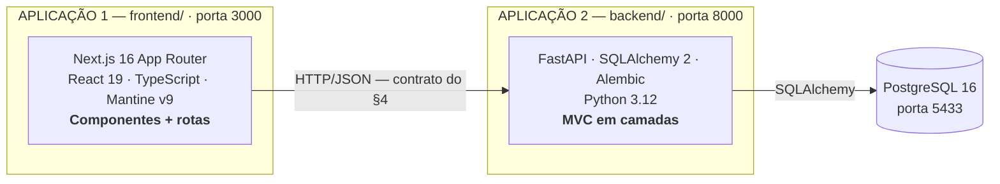
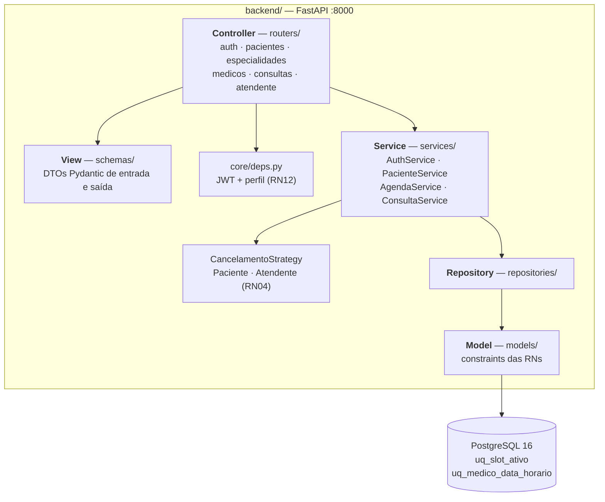

# Arquitetura

> **Leia primeiro.** Este projeto tem **duas aplicações**, não uma. Elas vivem no mesmo
> repositório (monorepo — [ADR-001](adr/ADR-001-monorepo.md)), mas são **processos separados,
> com stacks separadas, ciclos de build separados e arquiteturas internas diferentes**.
>
> - **§2 — Backend** (Python/FastAPI): é aqui que está o **MVC em camadas** que a AV2 avalia.
> - **§3 — Frontend** (TypeScript/Next.js): tem arquitetura própria, baseada em componentes e
>   rotas. **Não é MVC** e não faz sentido forçá-lo a ser.
> - **§4 — Integração**: o contrato HTTP que liga as duas.
>
> Versões anteriores deste documento tratavam as duas como se fossem um único MVC, com a
> pasta `frontend/` no papel de "View". Isso estava impreciso e foi corrigido — justificativa
> no [ADR-008](adr/ADR-008-rebaseline-escopo.md) §3.

---

## 1. Visão geral do sistema



| | Backend | Frontend |
|---|---|---|
| Pasta | `backend/` | `frontend/` |
| Linguagem | Python 3.12 | TypeScript 5.7 |
| Framework | FastAPI | Next.js 16 (App Router) |
| Estilo arquitetural | **MVC em camadas** | **Componentes + rotas (App Router)** |
| Gerenciador de pacotes | pip / `requirements.txt` | **yarn** (nunca npm/pnpm) |
| Testes | pytest | Vitest + Testing Library |
| Imagem Docker | `python:3.12-slim` | `node:22-alpine` |
| Onde fica o estado | Banco de dados | Memória do React + token no `localStorage` |

**Por que monorepo e não dois repositórios.** Com 6 pessoas e 8 dias úteis, dois repositórios
custariam dois CIs, dois controles de versão e trabalho constante para manter o contrato da API
sincronizado. O monorepo dá um PR único quando uma US atravessa as duas pontas. O preço é
disciplina de pastas — que este documento formaliza. Detalhes em
[ADR-001](adr/ADR-001-monorepo.md).

---

## 2. Backend — MVC em camadas

Esta é a arquitetura que o enunciado da AV2 cobra ("desenvolver e documentar a arquitetura
MVC"). Ela existe **inteira dentro de `backend/`**.

### 2.1 O MVC clássico e a adaptação deste projeto

O MVC nasceu para aplicações em que o servidor renderiza HTML: a **View** era um template que o
**Controller** preenchia com dados do **Model**. Numa API REST essa View não existe — o
Controller devolve JSON.

Há duas saídas honestas para essa diferença:

1. Dizer que o app React é a View do MVC. **É frouxo:** o React tem roteamento próprio, estado
   próprio e build próprio; ele não é preenchido pelo Controller, ele *consome* uma API.
2. Assumir que **a View do backend é a camada de serialização** — os schemas Pydantic, que
   transformam o Model no JSON de resposta. É a mesma leitura que o Django REST Framework usa
   (`Serializer` no papel de View).

**Decisão: opção 2.** O MVC deste projeto se fecha dentro do backend.

| Camada MVC | Pasta | Responsabilidade | Não pode |
|---|---|---|---|
| **Model** | `backend/app/models/` | Entidades SQLAlchemy, relacionamentos e constraints que materializam as RNs no banco | Ter lógica de aplicação |
| **View** | `backend/app/schemas/` | DTOs Pydantic: o que entra e o que sai da API. É a representação do Model para o mundo externo | Consultar o banco |
| **Controller** | `backend/app/routers/` | Receber requisição, autorizar por perfil, chamar **um** service, commitar, devolver o schema de resposta | Conter regra de negócio ou montar query |

E duas camadas de apoio, que o Módulo 4 trata em "definição de padrões" e sem as quais o
Controller vira o clássico *fat controller*:

| Camada extra | Pasta | Por que existe |
|---|---|---|
| **Service** | `backend/app/services/` | Concentra a regra de negócio. Sem ela, a RN vaza para o Controller ou para o Model |
| **Repository** | `backend/app/repositories/` | Isola o acesso a dados. É o que permite testar Service sem subir banco — ver [`06-design-patterns.md`](06-design-patterns.md) |

### 2.2 Fluxo e regra de dependência

O sentido é **sempre para dentro**. Nenhuma camada conhece quem a chama.

```
HTTP  ──▶  Controller  ──▶  Service  ──▶  Repository  ──▶  Model  ──▶  PostgreSQL
 ▲          (routers)      (services)   (repositories)    (models)
 │              │              │
 │              │              └── depende de RepositorioBase (abstração),
 │              │                  não de Session  ← DIP
 │              │
 │              └── serializa a resposta com o schema (View)
 │
 └── exceção de domínio traduzida em status HTTP pelo handler
```

Proibições verificáveis por `grep`, rodadas no job `quality-gate` do CI:

| Proibição | Verificação |
|---|---|
| Service não importa `fastapi` nem `HTTPException` | `grep -r "fastapi\|HTTPException" backend/app/services/` |
| Service não monta query | `grep -r "select(" backend/app/services/` |
| Repository não faz `commit()` | `grep -r "\.commit()" backend/app/repositories/` |
| Controller não decide regra de negócio | revisão de PR (checklist do template) |

O `commit()` é responsabilidade do Controller: **uma requisição = uma transação**. O Repository
faz apenas `flush()`, o que dá `id` ao objeto sem encerrar a transação — assim uma regra que
falha depois de um `salvar()` desfaz tudo.

### 2.3 Componentes do backend



### 2.4 Estrutura de pastas do backend

```
backend/
├── Dockerfile                  # multi-stage (base → deps → runtime)
├── pyproject.toml              # deps, pytest, ruff, coverage
├── alembic/                    # migrações versionadas
├── tests/
│   ├── unit/                   # Service com fakes de repositório (sem banco)
│   └── integration/            # migrações + smoke da API
└── app/
    ├── main.py                 # CORS, handlers, routers, /health
    ├── core/
    │   ├── config.py           # Settings (12-factor)
    │   ├── database.py         # engine, SessionLocal, Base, get_db
    │   ├── security.py         # bcrypt (RN11) + JWT (RN13)
    │   └── deps.py             # usuario_atual, exigir_atendente/paciente (RN12)
    ├── models/                 # ── MODEL ──
    ├── schemas/                # ── VIEW ── DTOs Pydantic (RN07, RN08, RN09)
    ├── routers/                # ── CONTROLLER ──
    ├── services/               # regra de negócio + Strategy
    ├── repositories/           # Repository Pattern
    ├── exceptions/             # domínio + handler HTTP
    └── seeds/seed.py           # bootstrap idempotente (RN14)
```

---

## 3. Frontend — arquitetura de componentes e rotas

**O frontend não é MVC.** Next.js App Router não tem Controller, não tem Model e não tem uma
View no sentido do MVC. Forçar esse vocabulário aqui confundiria a avaliação. A arquitetura
dele tem outro nome e outras regras.

### 3.1 Estilo: componentes + roteamento por arquivo, com acesso a dados isolado

```
Rota (app/**/page.tsx)
   │  monta a tela, resolve params, aplica a guarda de perfil
   ▼
Componente de tela  ──▶  Componente de apresentação (components/)
   │                     recebe props; não sabe de onde vieram os dados
   ▼
Cliente HTTP (lib/api.ts)  ──▶  Tipos de domínio (types/dominio.ts)
   │  único ponto do app que conhece a URL da API
   ▼
Backend
```

| Camada do frontend | Pasta | Responsabilidade | Não pode |
|---|---|---|---|
| **Rotas** | `src/app/` | Navegação, route groups por perfil, guarda de rota no `layout.tsx` | Conter regra de negócio ou chamar `fetch` direto |
| **Componentes** | `src/components/` | UI reutilizável (formulários, tabelas, cards). Recebem dados por props | Conhecer a URL da API |
| **Cliente de API** | `src/lib/api.ts` | **Único** lugar com `fetch`. Anexa o token e traduz erro HTTP em `ApiError` | Conter regra de negócio |
| **Validação de formato** | `src/lib/cpf.ts`, `@mantine/form` | Feedback imediato ao usuário (RN07, RN08) | **Ser a única validação** — o backend revalida sempre |
| **Tipos de domínio** | `src/types/dominio.ts` | Espelham os schemas Pydantic do backend | Divergir do backend sem PR nos dois lados |

### 3.2 A analogia com o MVC — e onde ela quebra

Vale registrar porque a pergunta costuma aparecer na apresentação:

| MVC do backend | "Equivalente" no frontend | Por que **não** é a mesma coisa |
|---|---|---|
| Model | `types/dominio.ts` | São tipos de compilação. Não persistem, não validam em runtime, não têm comportamento |
| View | JSX dos componentes | Aproximação razoável — é a única correspondência que se sustenta |
| Controller | `page.tsx` + handlers de evento | O Controller do MVC é acionado por requisição HTTP; aqui é acionado por evento do usuário e mantém estado entre eventos |

Conclusão para os slides: **o MVC avaliado é o do backend.** O frontend contribui com separação
de responsabilidades por outro caminho — componentes puros, cliente HTTP único e guarda de rota
isolada — e isso é documentado como arquitetura própria, não como "a View do MVC".

### 3.3 Regras não-negociáveis do frontend

- **Mantine v9 é a única biblioteca de UI.** Nada de Tailwind, MUI ou shadcn.
- **Todo `fetch` passa por `src/lib/api.ts`.** Nenhum componente chama a API direto.
- **Regra de negócio não vive no componente.** Validação de formato, sim; decisão de negócio,
  não. Se o botão "Cancelar" precisa sumir por causa da RN04, quem decide é o backend — a
  resposta traz `pode_cancelar`, e o React apenas obedece.
- **Componentes Mantine não funcionam em Server Component.** Tela com interação precisa de
  `'use client'` no topo. Compound components (`List.Item`, `Table.Thead`) quebram o
  `next build` em RSC — use import nomeado (`ListItem`) ou `'use client'`. A guarda
  `frontend/__tests__/server-components.test.ts` antecipa isso no `yarn test`.
- **`params` e `searchParams` são `Promise` no Next 16.** Use `PageProps<'/consultas/[id]'>`.
- **Guarda de rota fica no `layout.tsx` do route group.** Não crie `middleware.ts`/`proxy.ts`.

### 3.4 Estrutura de pastas do frontend

```
frontend/
├── Dockerfile                  # dev / builder / runtime
├── next.config.mjs             # rewrite /api → backend + optimizePackageImports
├── postcss.config.cjs          # postcss-preset-mantine
├── vitest.config.mts           # Vitest + plugin React + tsconfig paths
├── vitest.setup.ts             # mocks do Mantine + tipos do jest-dom
├── test-utils/                 # render() já com MantineProvider
├── __tests__/                  # testes de unidade e guardas
└── src/
    ├── theme.ts                # tema Mantine da clínica
    ├── app/                    # rotas (App Router)
    │   ├── layout.tsx          # MantineProvider + ColorSchemeScript
    │   ├── login/
    │   ├── (paciente)/         # route group com guarda de perfil
    │   └── (atendente)/        # route group com guarda de perfil
    ├── components/             # UI reutilizável
    ├── lib/api.ts              # cliente HTTP único
    ├── lib/cpf.ts              # validação de CPF no cliente (RN07)
    └── types/dominio.ts        # tipos espelhando os schemas do backend
```

Mapa de rotas por User Story: [`frontend/src/app/README.md`](../frontend/src/app/README.md).

---

## 4. Integração entre as duas aplicações

### 4.1 Como o frontend alcança o backend

O navegador **nunca** fala com `localhost:8000` direto. Ele chama `/api/*` no próprio Next, que
repassa para o FastAPI via `rewrites()` do `next.config.mjs`:

```
Navegador ──▶ Next.js :3000 ──▶ FastAPI :8000
              /api/consultas    BACKEND_INTERNAL_URL + /api/consultas
```

Isso evita CORS no dia a dia e mantém uma origem só. `BACKEND_INTERNAL_URL` vale
`http://backend:8000` dentro do Docker e `http://localhost:8000` fora.

### 4.2 Contrato da API

Documentação interativa gerada pelo FastAPI: `http://localhost:8000/docs`.

| Método | Rota | Perfil | US | Regras |
|---|---|---|---|---|
| POST | `/api/auth/login` | público | US-00 | RN11, RN13 |
| GET | `/api/auth/verificar-cpf/{cpf}` | público | US-00 | RN07 |
| POST | `/api/auth/vincular-ou-criar` | público | US-00 | RN01, RN02, RN07 |
| POST | `/api/pacientes` | ATENDENTE | US-03 | RN01, RN02, RN07, RN08 |
| GET | `/api/pacientes` | ATENDENTE | US-03 | RN12 |
| PUT | `/api/pacientes/me` | PACIENTE | US-04 | RN02, RN08 |
| POST | `/api/especialidades` | ATENDENTE | US-01 | — |
| GET | `/api/especialidades` | autenticado | US-01, US-06 | — |
| POST | `/api/medicos` | ATENDENTE | US-02 | RN02 |
| GET | `/api/medicos?especialidade_id=` | autenticado | US-02, US-06 | — |
| POST | `/api/medicos/{id}/agenda` | ATENDENTE | US-05 | RN05, RN09 |
| GET | `/api/medicos/{id}/horarios-livres?data=` | autenticado | US-07 | RN03 |
| POST | `/api/consultas` | PACIENTE | US-08 | RN03 |
| GET | `/api/consultas` | PACIENTE | US-10 | RN12 |
| GET | `/api/consultas/{id}` | PACIENTE | US-10 | RN12 |
| PATCH | `/api/consultas/{id}/cancelar` | PACIENTE | US-11 | RN04, RN10, RN15 |
| POST | `/api/atendente/consultas` | ATENDENTE | US-09 | RN03, RN05 |
| GET | `/api/atendente/consultas` | ATENDENTE | US-09, US-12 | RN12 |
| PATCH | `/api/atendente/consultas/{id}/cancelar` | ATENDENTE | US-12 | RN10 |
| PATCH | `/api/atendente/consultas/{id}/status` | ATENDENTE | US-13 | RN06, RN10 |
| GET | `/health` | público | — | usado por Docker e CI |

Códigos padronizados: **401** sem token · **403** perfil errado · **404** inexistente ·
**409** conflito de unicidade ou disponibilidade · **422** regra temporal ou transição inválida.

### 4.3 Como um erro de negócio atravessa as duas aplicações

```
BACKEND
  PacienteService._garantir_cpf_inedito()
        │  raise CpfDuplicado          (status_code = 409, mensagem pronta)
        ▼
  exceptions/handlers.py  @app.exception_handler(RegraDeNegocioViolada)
        ▼
  HTTP 409  { "detail": "CPF ja cadastrado", "erro": "CpfDuplicado" }
─────────────────────────────────────────────────────────────────────
FRONTEND
        ▼
  src/lib/api.ts  →  throw new ApiError("CPF ja cadastrado", 409)
        ▼
  notifications.show({ message: erro.message, color: 'red' })
```

O Service nunca soube que existia HTTP. O componente React nunca soube que existia SQL.

### 4.4 Contratos que mudam nos dois lados juntos

Estes três pontos são o acoplamento real entre as aplicações. Mudança em qualquer um deles é
**um PR só**, tocando as duas pastas:

1. **Formato do JSON** — schema Pydantic ↔ `types/dominio.ts`
2. **Caminho e método da rota** — router ↔ `lib/api.ts`
3. **Código HTTP de erro** — exceção de domínio ↔ tratamento no `lib/api.ts`

---

## 5. Concorrência (cenário da US-08)

A US-08 descreve o caso: dois pacientes clicam em "Confirmar" no mesmo horário ao mesmo tempo.
Defesa em duas camadas, ambas no backend:

1. **Lock pessimista** — `HorarioRepository.buscar_para_reserva()` usa `SELECT ... FOR UPDATE`.
   A segunda transação espera a primeira e enxerga `disponivel = False`, recebendo
   `409 HorarioIndisponivel`.
2. **Índice parcial `uq_slot_ativo`** — garantia de último recurso, no banco. Se algum caminho
   futuro esquecer o lock, o banco recusa.

O frontend não participa da defesa: exibe o 409 como notificação e recarrega a grade.

---

## 6. Segurança

- **RN11** — senha com bcrypt via `passlib`. `senha_hash` nunca aparece em schema de resposta.
- **RN12/RN13** — JWT `HS256` com `sub`, `tipo_usuario`, `paciente_id` e `exp`.
  `exigir_atendente` / `exigir_paciente` como dependência de rota. A guarda do frontend é
  **conveniência de UX, não segurança** — quem barra de verdade é o backend.
- **Escopo de dados do paciente** — toda operação usa `usuario.paciente_id` extraído do token,
  nunca um id vindo do path ou do body.
- **RN14** — não existe rota pública de cadastro de atendente. O primeiro vem do seed.
- **CORS** — origens explícitas via `CORS_ORIGINS`, sem `*`.
- **Segredos** — só por variável de ambiente. `.env` no `.gitignore`.

---

## 7. Decisões registradas (ADRs)

| ADR | Decisão |
|---|---|
| [ADR-001](adr/ADR-001-monorepo.md) | Monorepo com `backend/` e `frontend/` |
| [ADR-002](adr/ADR-002-camadas-mvc.md) | Camadas Controller → Service → Repository → Model |
| [ADR-003](adr/ADR-003-autenticacao.md) | Login flexível CPF ou e-mail com JWT |
| [ADR-004](adr/ADR-004-bootstrap-atendente.md) | Seed idempotente + RN14 |
| [ADR-005](adr/ADR-005-cadastro-paciente.md) | Auto-cadastro e cadastro por atendente convergindo |
| [ADR-006](adr/ADR-006-design-patterns.md) | Strategy + Repository; índice parcial para a RN03 |
| [ADR-007](adr/ADR-007-vitest.md) | Vitest no Next.js em vez de Jest |
| [ADR-008](adr/ADR-008-rebaseline-escopo.md) | Rebaseline de escopo e separação backend × frontend na documentação |
