# Modelo de dados

PostgreSQL 16, esquema versionado por Alembic. **Nunca** use `Base.metadata.create_all()` —
o esquema só muda por migração.

---

## 1. Diagrama entidade-relacionamento

```mermaid
erDiagram
    USUARIO {
        int id PK
        varchar nome "obrigatorio"
        varchar login UK "CPF (paciente) ou e-mail (atendente)"
        varchar senha_hash "bcrypt - RN11"
        enum tipo_usuario "PACIENTE | ATENDENTE"
        int paciente_id FK "nullable, unico"
        boolean ativo "default true"
        timestamptz criado_em
    }

    PACIENTE {
        int id PK
        varchar nome "obrigatorio"
        varchar cpf UK "11 digitos - RN01"
        varchar email UK "NULLABLE - RN02"
        varchar telefone "obrigatorio"
        date data_nascimento "nullable"
        boolean ativo "soft delete"
        timestamptz criado_em
    }

    ESPECIALIDADE {
        int id PK
        varchar nome UK
        text descricao "nullable"
        boolean ativo
    }

    MEDICO {
        int id PK
        varchar nome
        varchar email UK "RN02"
        varchar crm UK
        int especialidade_id FK
        boolean ativo "soft delete"
    }

    HORARIO_DISPONIVEL {
        int id PK
        int medico_id FK
        date data
        time horario
        boolean disponivel "RN03"
    }

    CONSULTA {
        int id PK
        int paciente_id FK
        int medico_id FK
        int horario_disponivel_id FK
        enum status "RN06"
        timestamptz data_agendamento
        text motivo_cancelamento "nullable"
    }

    PACIENTE ||--o| USUARIO : "tem credencial"
    ESPECIALIDADE ||--o{ MEDICO : "classifica"
    MEDICO ||--o{ HORARIO_DISPONIVEL : "tem agenda"
    PACIENTE ||--o{ CONSULTA : "agenda"
    MEDICO ||--o{ CONSULTA : "atende"
    HORARIO_DISPONIVEL ||--o{ CONSULTA : "reservado por"
```



---

## 2. Constraints que materializam as regras

Regra de negócio garantida **no banco** não pode ser burlada por bug de aplicação, script
manual ou requisição concorrente. É a primeira linha de defesa.

| Regra | Constraint | Objeto |
|---|---|---|
| RN01 | `UNIQUE (cpf)` | `paciente.cpf` |
| RN02 | `UNIQUE (email)` × 2 + `UNIQUE (login)` | `paciente.email`, `medico.email`, `usuario.login` |
| RN03 | `CREATE UNIQUE INDEX ... WHERE status IN ('SOLICITADA','CONFIRMADA')` | `uq_slot_ativo` |
| RN05 | `UNIQUE (medico_id, data, horario)` | `uq_medico_data_horario` |
| RN06 | `ENUM status_consulta` | tipo `status_consulta` |
| — | `UNIQUE (paciente_id)` em `usuario` | um paciente tem no máximo uma credencial |
| — | FKs em todas as relações | integridade referencial (RNF10) |

### RN02 e o e-mail nulo

`paciente.email` é *nullable* porque paciente de balcão pode não ter e-mail. Em PostgreSQL,
`UNIQUE` **permite múltiplos `NULL`** — que é exatamente o comportamento desejado: dois
pacientes sem e-mail não colidem. Coberto por CTU02b e CT03 passo 4.

### RN03 e o índice parcial

```sql
CREATE UNIQUE INDEX uq_slot_ativo
  ON consulta (horario_disponivel_id)
  WHERE status IN ('SOLICITADA', 'CONFIRMADA');
```

Um `UNIQUE` comum tornaria o slot inutilizável para sempre após o primeiro cancelamento,
porque a linha CANCELADA continuaria ocupando o índice — quebrando a US-11. Análise completa
em [14-conflitos-e-decisoes.md](14-conflitos-e-decisoes.md) §C03 e
[ADR-006](adr/ADR-006-design-patterns.md).

**O `alembic revision --autogenerate` não detecta índice parcial.** Ao gerar a migração inicial,
confira se `postgresql_where` aparece no arquivo — se não, adicione à mão:

```python
op.create_index(
    "uq_slot_ativo", "consulta", ["horario_disponivel_id"], unique=True,
    postgresql_where=sa.text("status IN ('SOLICITADA', 'CONFIRMADA')"),
)
```

---

## 3. Decisões de modelagem

### Credencial separada dos dados cadastrais

`usuario` (autenticação) e `paciente` (dados cadastrais) são tabelas distintas. Motivos:

- O atendente tem credencial mas não é paciente (`paciente_id = NULL`).
- O paciente pode existir **sem** credencial — cadastrado no balcão, ainda sem primeiro acesso.
  É o que viabiliza o fluxo do [ADR-005](adr/ADR-005-cadastro-paciente.md).
- Trocar senha não toca em dado cadastral, e vice-versa (SRP no nível de dados).

### `nome` em `usuario`

A modelagem inicial não tinha `nome` em `usuario`: o nome do paciente vinha por `paciente_id`.
Mas o atendente tem `paciente_id = NULL` — não haveria como exibir "Olá, Maria" no painel dele
nem auditar quem cancelou o quê. Coluna adicionada (conflito C06).

### Médico 1:N especialidade

`medico.especialidade_id` é FK direta, não tabela associativa. Suficiente para o MVP e mantém a
US-06 (filtro por especialidade) simples. Médico com duas especialidades é migração aditiva
depois (conflito C11).

### `horario_disponivel` como slot discreto

Cada linha é um horário atendível (`data` + `horario`), não um intervalo. Simplifica a RN03
(reservar = marcar um slot) e a RN05 (unique de três colunas). Duração da consulta é implícita
no espaçamento com que o atendente lança a grade.

### Soft delete

`ativo boolean` em `paciente`, `medico`, `especialidade`, `usuario`. Toda listagem filtra por
`ativo = true`, e nenhum registro é apagado fisicamente — desativar um médico não apagaria o
histórico de consultas dele.

> **No MVP a coluna é lida, nunca escrita como `false`.** Inativar médico (MF04) e excluir
> especialidade (MF03) ficaram fora do escopo ([ADR-008](adr/ADR-008-rebaseline-escopo.md)), e
> não há nenhum ponto no código que faça `ativo = False`. A coluna permanece porque o filtro
> `WHERE ativo = true` já está nas queries e porque adicioná-la depois exigiria migração em
> quatro tabelas — custo maior do que mantê-la agora. É preparação deliberada, não código morto
> por descuido.

### `disponivel` redundante com o índice parcial — de propósito

`horario_disponivel.disponivel` é derivável de `consulta`, mas existe para que
`GET /horarios-livres` (US-07) seja uma consulta simples e rápida, sem `LEFT JOIN` com
subconsulta de status. É desnormalização deliberada, mantida consistente em um único lugar
(`ConsultaService`). O índice parcial é a garantia caso ela divirja.

### `TIMESTAMPTZ`, não `TIMESTAMP`

`criado_em` e `data_agendamento` são `timezone=True`. Sem isso, comparar com "agora" em outro
fuso dá erro de 3 horas — que faria uma consulta de 26h parecer de 23h e bloquear um
cancelamento legítimo (RN15, conflito C10).

---

## 4. Migrações

```bash
make migration m="cria esquema inicial"   # gera
# revisar o arquivo em backend/alembic/versions/ ANTES de aplicar
make migrate                              # aplica
```

Regras:

- Toda mudança de esquema é migração. Nunca `create_all()`.
- **Ler** o arquivo gerado antes de commitar: o autogenerate erra em índice parcial, ENUM e
  `server_default`.
- Migração já mergeada em `develop` é imutável — corrija com uma nova.
- `downgrade()` preenchido sempre que for razoável.
- O job `docker` do CI roda `alembic upgrade head` do zero, o que valida a cadeia inteira.

---

## 5. Consultas úteis para o QA

```sql
-- RN01: CPF duplicado (deve retornar vazio)
SELECT cpf, COUNT(*) FROM paciente GROUP BY cpf HAVING COUNT(*) > 1;

-- RN05: slot duplicado do mesmo medico (deve retornar vazio)
SELECT medico_id, data, horario, COUNT(*)
  FROM horario_disponivel GROUP BY 1,2,3 HAVING COUNT(*) > 1;

-- RN03: slot com mais de uma consulta ATIVA (deve retornar vazio)
SELECT horario_disponivel_id, COUNT(*)
  FROM consulta WHERE status IN ('SOLICITADA','CONFIRMADA')
  GROUP BY 1 HAVING COUNT(*) > 1;

-- CT10: slot com consulta cancelada E consulta ativa (esperado: existir)
SELECT horario_disponivel_id, array_agg(status)
  FROM consulta GROUP BY 1 HAVING COUNT(*) > 1;

-- Coerencia do flag `disponivel` com a realidade (deve retornar vazio)
SELECT h.id, h.disponivel, COUNT(c.id) AS consultas_ativas
  FROM horario_disponivel h
  LEFT JOIN consulta c ON c.horario_disponivel_id = h.id
       AND c.status IN ('SOLICITADA','CONFIRMADA')
  GROUP BY h.id, h.disponivel
  HAVING (h.disponivel = false AND COUNT(c.id) = 0)
      OR (h.disponivel = true  AND COUNT(c.id) > 0);

-- RN11: nenhuma senha em texto claro (todo hash bcrypt comeca com $2)
SELECT id, login FROM usuario WHERE senha_hash NOT LIKE '$2%';
```

Acesso: `docker compose exec postgres psql -U clinica -d clinica_db`
