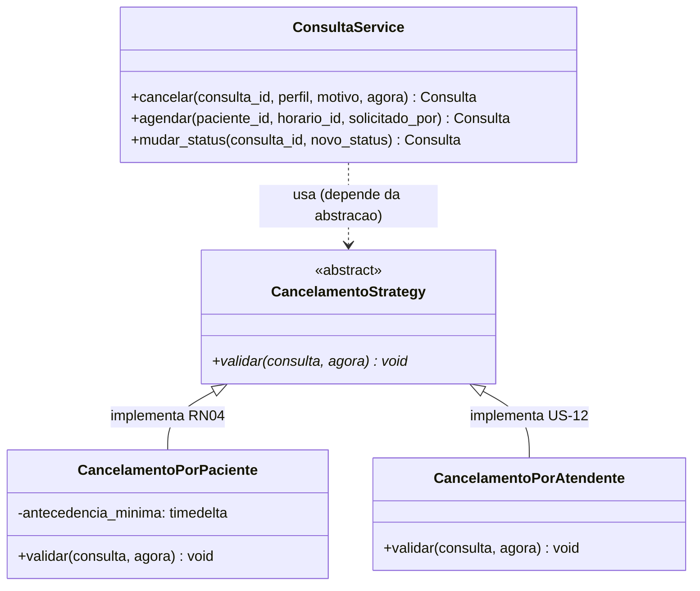
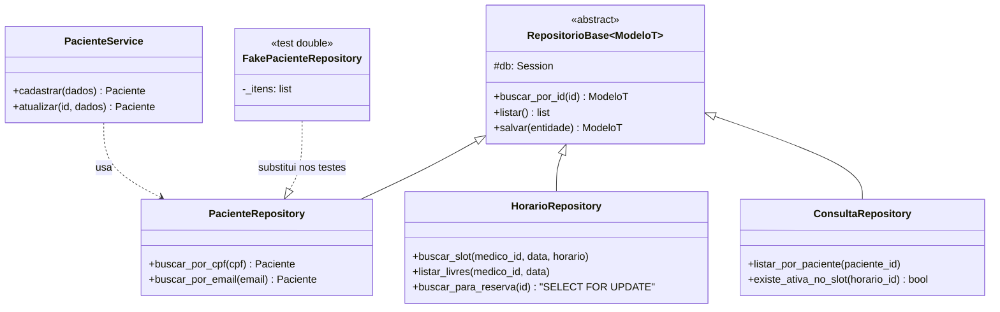

# Design Patterns aplicados

Entregável do Engenheiro de Software: **2 padrões de projeto**, implementados e justificados.
Base: *Módulo 3 — Design Patterns* e *Case - Design Patterns* (`material-aulas/`).

Critério de escolha: cada padrão precisa resolver um problema **real deste MVP**. Padrão
aplicado sem problema para resolver é complexidade acidental — e o Módulo 3 trata isso como
antipadrão.

| # | Padrão | Categoria (GoF) | Problema que resolve |
|---|---|---|---|
| 1 | **Strategy** | Comportamental | A regra de cancelamento muda conforme o perfil (RN04 vs. US-12) |
| 2 | **Repository** | Arquitetural / acesso a dados | Regra de negócio acoplada ao SQLAlchemy impede testar sem banco |

---

## Padrão 1 — Strategy

**Arquivo:** `backend/app/services/cancelamento_strategy.py`

### O problema

Duas regras de cancelamento para a mesma operação:

- **Paciente** — só pode cancelar com ≥ 24h de antecedência (**RN04**)
- **Atendente** — cancela a qualquer momento, para tratar imprevistos (**US-12**)

A solução ingênua é um condicional dentro do service:

```python
def cancelar(self, consulta_id, perfil):
    consulta = self._buscar_ou_falhar(consulta_id)

    if perfil == "PACIENTE":
        antecedencia = momento_agendado(consulta) - datetime.now()
        if antecedencia < timedelta(hours=24):
            raise CancelamentoNaoPermitido
    elif perfil == "ATENDENTE":
        pass
    # e quando entrar MEDICO? e SUPERVISOR? → editar esta função de novo

    consulta.status = StatusConsulta.CANCELADA
```

É exatamente o antipadrão que o Módulo 2 mostra em `PaymentProcessor` com
`if type == 'credit' / elif 'debit' / elif 'paypal'` e resolve com Strategy: *"Adicionar novo
tipo de pagamento requer modificar a classe existente"* → viola **Open/Closed**.

Além do OCP, o `if` traz três problemas concretos:

1. Testar a regra de 24h exige instanciar o service inteiro.
2. `datetime.now()` embutido torna o teste dependente do relógio.
3. A regra de prazo fica misturada com a mudança de estado — duas razões para a função mudar.

### A solução

```python
class CancelamentoStrategy(ABC):
    @abstractmethod
    def validar(self, consulta: Consulta, agora: datetime) -> None:
        """Levanta CancelamentoNaoPermitido quando o cancelamento nao e permitido."""


class CancelamentoPorPaciente(CancelamentoStrategy):
    """RN04 - exige antecedencia minima."""

    def __init__(self, antecedencia_minima_horas: int = 24):
        self.antecedencia_minima = timedelta(hours=antecedencia_minima_horas)

    def validar(self, consulta: Consulta, agora: datetime) -> None:
        if momento_agendado(consulta) - agora < self.antecedencia_minima:
            raise CancelamentoNaoPermitido


class CancelamentoPorAtendente(CancelamentoStrategy):
    """US-12 - atendente cancela sem restricao de prazo."""

    def validar(self, consulta: Consulta, agora: datetime) -> None:
        return None


def obter_strategy(perfil: TipoUsuario, antecedencia_horas: int = 24) -> CancelamentoStrategy:
    """Factory simples que resolve a estrategia a partir do perfil autenticado."""
    if perfil is TipoUsuario.PACIENTE:
        return CancelamentoPorPaciente(antecedencia_horas)
    return CancelamentoPorAtendente()
```

E o service passa a ter uma única razão para mudar:

```python
def cancelar(self, consulta_id, perfil, motivo=None, agora=None) -> Consulta:
    consulta = self._buscar_ou_falhar(consulta_id)
    self._garantir_transicao(consulta.status, StatusConsulta.CANCELADA)

    strategy = obter_strategy(perfil, settings.CANCELAMENTO_ANTECEDENCIA_HORAS)
    strategy.validar(consulta, agora or self._agora())

    consulta.status = StatusConsulta.CANCELADA
    consulta.motivo_cancelamento = motivo
    consulta.horario.disponivel = True   # RN03
    return self.consultas.salvar(consulta)
```

### Diagrama



### Benefícios verificáveis

| Benefício | Evidência |
|---|---|
| **OCP** — extensível sem modificar | Perfil novo = classe nova; `ConsultaService` intacto |
| **SRP** — regra de prazo separada da mudança de estado | `validar()` só valida |
| **LSP** — implementações intercambiáveis | O service não sabe qual Strategy recebeu |
| **Testabilidade** | `agora` é parâmetro → teste determinístico, sem `freeze_time` obrigatório |
| **Parametrizável** | 24h vem de `settings`, não hardcoded — dá para demonstrar com 0h |

### Testes que cobrem o padrão

`backend/tests/unit/test_consulta_service.py`

- `test_ctu04_deve_bloquear_cancelamento_do_paciente_com_menos_de_24h` — RN04 negativo
- `test_paciente_pode_cancelar_com_mais_de_24h_e_slot_e_liberado` — RN04 positivo + RN03
- `test_atendente_cancela_ignorando_a_regra_de_24h` — a outra Strategy
- `test_nao_permite_cancelar_consulta_ja_finalizada` — RN10 antes da Strategy

### Alternativas consideradas

| Alternativa | Por que não |
|---|---|
| `if perfil ==` no service | Viola OCP; é o antipadrão do material |
| Duas rotas com regra duplicada | Duplicação; a mudança de estado é idêntica nos dois casos |
| Chain of Responsibility | Só há uma validação por perfil; corrente de um elo é exagero |
| Template Method | Exigiria herança de `ConsultaService`; acopla mais |

---

## Padrão 2 — Repository

**Arquivos:** `backend/app/repositories/base.py` e `*_repository.py`

### O problema

Com o SQLAlchemy chamado direto no service, a regra de negócio fica colada na persistência:

```python
class PacienteService:
    def cadastrar(self, dados, db: Session):
        existente = db.scalars(
            select(Paciente).where(Paciente.cpf == dados.cpf)
        ).first()
        if existente:
            raise CpfDuplicado
        ...
```

Consequências:

1. **Testar a RN01 exige PostgreSQL rodando.** O teste fica lento e frágil; sem banco, nada roda.
2. A mesma query de CPF se espalha por vários services (duplicação).
3. Se um dia trocar SQLAlchemy, ou consultar por outra fonte, todo service muda.
4. O service passa a ter duas razões para mudar: a regra e a forma de consultar.

O Módulo 4 nomeia isso ao tratar de acoplamento: o objetivo da arquitetura é
*"garantir atributos de qualidade como manutenibilidade, testabilidade e baixo acoplamento"*.

### A solução

Base genérica com o CRUD comum:

```python
ModeloT = TypeVar("ModeloT", bound=Base)

class RepositorioBase(ABC, Generic[ModeloT]):
    modelo: type[ModeloT]

    def __init__(self, db: Session):
        self.db = db

    def buscar_por_id(self, id_: int) -> ModeloT | None:
        return self.db.get(self.modelo, id_)

    def listar(self) -> list[ModeloT]:
        return list(self.db.scalars(select(self.modelo)).all())

    def salvar(self, entidade: ModeloT) -> ModeloT:
        self.db.add(entidade)
        self.db.flush()      # flush, nunca commit — a transacao e do router
        return entidade
```

Concretos expõem só o que aquele domínio precisa (**ISP**):

```python
class PacienteRepository(RepositorioBase[Paciente]):
    modelo = Paciente

    def buscar_por_cpf(self, cpf: str) -> Paciente | None:
        return self.db.scalars(select(Paciente).where(Paciente.cpf == cpf)).first()

    def buscar_por_email(self, email: str) -> Paciente | None:
        return self.db.scalars(select(Paciente).where(Paciente.email == email)).first()
```

E o service volta a falar só de negócio:

```python
class PacienteService:
    def __init__(self, repositorio: PacienteRepository):   # DIP
        self.repositorio = repositorio

    def _garantir_cpf_inedito(self, cpf: str) -> None:
        """RN01."""
        if self.repositorio.buscar_por_cpf(cpf):
            raise CpfDuplicado
```

### Diagrama



### O benefício que se mede

Os fakes em `tests/conftest.py` implementam a mesma interface com listas em memória:

```python
class FakePacienteRepository:
    def buscar_por_cpf(self, cpf):
        return next((p for p in self._itens if p.cpf == cpf), None)
```

Resultado real, medido: **17 testes unitários em ~3 segundos, sem PostgreSQL**.

```
tests/unit/test_agenda_service.py ...       [ 17%]
tests/unit/test_auth_service.py .....       [ 47%]
tests/unit/test_consulta_service.py ......  [ 82%]
tests/unit/test_paciente_service.py ...     [100%]
============ 17 passed in 2.95s ============
```

Fake e não `MagicMock`: o fake tem comportamento (a lista realmente guarda e busca), então o
teste valida a lógica de verdade em vez de só verificar se um método foi chamado.

### Onde o Repository resolveu um problema difícil

`HorarioRepository.buscar_para_reserva()` encapsula o `SELECT ... FOR UPDATE` da RN03/US-08:

```python
def buscar_para_reserva(self, horario_id: int) -> HorarioDisponivel | None:
    """SELECT ... FOR UPDATE - evita corrida de dois pacientes no mesmo slot (US-08)."""
    return self.db.scalars(
        select(HorarioDisponivel)
        .where(HorarioDisponivel.id == horario_id)
        .with_for_update()
    ).first()
```

O detalhe de lock pessimista fica em uma linha do repository. O `ConsultaService` só chama um
método com nome de intenção, sem saber que existe lock de banco.

### Alternativas consideradas

| Alternativa | Por que não |
|---|---|
| `Session` direto no service | Impede teste sem banco; espalha query |
| Active Record (query no model) | Model passa a ter duas responsabilidades |
| Unit of Work explícito | O `Session` do SQLAlchemy já é um UoW; o router delimita a transação |
| Query Object / CQRS | Complexidade sem retorno neste domínio |

---

## Padrões considerados e não adotados

Registrado para mostrar que a escolha foi deliberada, não por moda.

| Padrão | Onde caberia | Por que ficou fora |
|---|---|---|
| **Factory Method** | Criar `Consulta` conforme o perfil | `_status_inicial()` resolve em 3 linhas; uma fábrica aqui seria cerimônia |
| **Singleton** | `Settings` | Já resolvido por `@lru_cache` em `get_settings()` — Singleton explícito dificultaria o override em teste |
| **Observer** | Notificar paciente ao confirmar consulta | Notificação está fora do MVP |
| **Decorator** | Log/auditoria nos services | Sem requisito de auditoria; `Depends` do FastAPI já cobre autorização |
| **Builder** | Montar `Consulta` com muitos campos | Só 4 campos obrigatórios; Pydantic já é o construtor validado |
| **Adapter** | Integrar sistema legado | Não há integração no MVP |
| **State** | Ciclo de vida da consulta | `TRANSICOES_PERMITIDAS` (dict) é mais legível que 4 classes de estado para 4 status |

O `Case - Design Patterns` do curso aplica Singleton para configuração global e Factory Method
para pagamentos. Aqui, o equivalente de "configuração global" está resolvido por
`@lru_cache`, e não há a variabilidade de tipos que justificaria uma fábrica — por isso a
escolha recaiu em Strategy e Repository, que atacam problemas que este MVP realmente tem.

Decisão registrada em [ADR-006](adr/ADR-006-design-patterns.md).
