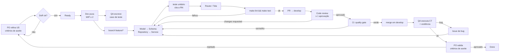

# Ciclo de desenvolvimento

Entregável do PO. Base: *O Guia do Scrum*, *Aula - Prática - Metodologia Ágil* e
*Aula - Prática 13-05* (`material-aulas/`).

---

## 1. Modelo escolhido: Scrum com quadro Kanban

**Scrum** para a cadência (2 sprints de 1 semana, cerimônias, papéis) e **Kanban** para o
fluxo visual e o limite de WIP.

O material do curso trata os dois casos: o case da plataforma educacional mostra que
waterfall com requisitos pouco claros e prazo curto gerou *"funcionalidades que não atendiam
o que o cliente queria, retrabalho constante, time desmotivado, nenhuma entrega utilizável"*
após 3 semanas. O nosso contexto é o mesmo: requisitos ambíguos (ver
[14-conflitos-e-decisoes.md](14-conflitos-e-decisoes.md)), prazo de 2 semanas, equipe com
níveis técnicos diferentes.

Por outro lado, o case do sistema de matrícula mostra que prazo fixo e necessidade de
documentação institucional puxam para cascata. A AV2 tem as duas coisas: prazo fixo **e**
documentação avaliada. Daí a escolha **híbrida**, como o próprio material sugere
("Híbrido - Scrum + Cascata"):

| Elemento | Abordagem | Por quê |
|---|---|---|
| Requisitos e arquitetura | **Antecipados** (feito neste planejamento) | Prazo fixo, documentação avaliada, conflitos do enunciado precisavam ser resolvidos antes |
| Desenvolvimento | **Iterativo** (2 sprints) | Requisitos ambíguos, feedback do PO a cada semana |
| Fluxo de trabalho | **Kanban** com WIP limit | Evita o overload que o case da EdTech apontou |
| Qualidade | **Contínua** (CI em cada push) | QA no fim é gargalo — problema explícito no material |

O que **não** copiamos do case da EdTech: *"QA só atua no final (gargalo)"*. Aqui o QA escreve
os casos de teste no dia 2–3, antes do código, e executa ao longo da sprint.

---

## 2. Papéis Scrum

| Papel Scrum | Quem | Observação |
|---|---|---|
| Product Owner | PO-A e PO-B | PO-A dono do backlog; PO-B conduz cerimônias |
| Scrum Master | PO-B | Acumula, dado o tamanho da equipe |
| Developers | ENG-A, ENG-B, QA-A, QA-B | No Scrum, "Developers" inclui QA |

Detalhes em [13-papeis-e-responsabilidades.md](13-papeis-e-responsabilidades.md).

---

## 3. Cerimônias

| Cerimônia | Quando | Duração | Objetivo | Saída |
|---|---|---|---|---|
| **Sprint Planning** | Início da sprint | 1h | Definir a meta e o Sprint Backlog | Itens em *Ready* com responsável |
| **Daily Scrum** | Todo dia, mesmo horário | 15 min | O que fiz / vou fazer / impedimentos | Impedimentos registrados no board |
| **Sprint Review** | Fim da sprint | 30 min | Demonstrar o incremento | PO aprova ou rejeita cada critério de aceite |
| **Retrospectiva** | Após a Review | 30 min | Melhorar o processo | 1 a 3 ações concretas com dono |

### Regras acordadas

- **Daily de 15 min é 15 min.** Discussão técnica que surgir vira conversa depois, com quem
  interessa. É o que o Guia do Scrum chama de foco no propósito do evento.
- **Review demonstra software funcionando**, não slide. Roda `make bootstrap` e navega.
- **Retrospectiva gera ação com dono e prazo.** "Vamos nos comunicar melhor" não é ação.
- **Impedimento vira item no board** com label `blocked`, não fica só na fala da daily.

---

## 4. Definition of Ready

Item só entra em *Ready* (e portanto só pode ser puxado) se:

- [ ] User Story no formato *Como… Quero… Para…*
- [ ] Critérios de aceite em Gherkin (Dado / Quando / Então)
- [ ] Regras de negócio referenciadas (RNxx)
- [ ] Tarefas quebradas em [BACKEND] / [FRONTEND] / [QA]
- [ ] Dependências identificadas
- [ ] Estimativa acordada pelo time
- [ ] Sem ambiguidade que exija decisão do PO durante a implementação

Item sem DoR entra em *Backlog*, não em *Ready*. Puxar item não refinado é a origem do
retrabalho descrito no case da plataforma educacional.

---

## 5. Definition of Done

Item só vai para *Done* se:

- [ ] Código na branch correta, PR aprovado por ≥ 1 pessoa
- [ ] Commits em Conventional Commits
- [ ] **CI verde** (backend, frontend, docker, quality-gate)
- [ ] Regras de negócio tocadas cobertas por teste citando o ID
- [ ] Sem `print` / `console.log` de depuração
- [ ] `docs/` atualizado se o comportamento mudou
- [ ] Caso de teste do QA executado com evidência (quando aplicável)
- [ ] **Critérios de aceite validados pelo PO**
- [ ] Merge em `develop`

"Funciona na minha máquina" não é Done — daí o job `docker` no CI.

---

## 6. Quadro Kanban

Colunas já existentes no board:

```
┌─────────────┬──────────┬──────────────┬──────────────┬──────────┐
│   BACKLOG   │  READY   │ IN PROGRESS  │  IN REVIEW   │   DONE   │
│             │          │  WIP: 2/pes  │   WIP: 5     │          │
├─────────────┼──────────┼──────────────┼──────────────┼──────────┤
│ priorizado  │ refinado │  em execução │ PR aberto    │ merged + │
│ pelo PO     │ com DoR  │  com dono    │ aguardando   │ validado │
│             │          │              │ revisão      │ pelo PO  │
└─────────────┴──────────┴──────────────┴──────────────┴──────────┘
```

### Políticas explícitas do fluxo

O case da EdTech no material lista exatamente os problemas que estas políticas evitam:

| Problema apontado no material | Política adotada |
|---|---|
| "Não há limite de trabalho em progresso (WIP)" | **WIP 2 por pessoa** em *In progress* |
| "Tarefas ficam paradas sem dono claro" | Item em *In progress* **tem** responsável ou volta a *Ready* |
| "QA só atua no final (gargalo)" | QA escreve CTs no dia 2–3 e executa durante a sprint |
| "Falta de métricas (lead time, cycle time)" | Métricas da §7, revisadas na Retrospectiva |
| "Falta de visibilidade do fluxo" | Board é a única fonte de verdade do status |
| "Bugs frequentes em produção" | Quality gate bloqueia merge; bug corrigido ganha teste de regressão |

### Regras de puxada

- Puxa-se **da direita para a esquerda**: antes de começar item novo, ajude a desbloquear o que
  está em *In review*.
- Item bloqueado recebe label `blocked` e o motivo em comentário.
- Débito técnico e antipadrão entram como item com label `tech-debt` — foi o que a *Aula
  Prática 13-05* pediu: *"documentar os antipadrões no quadro Kanban"*.

---

## 7. Métricas

| Métrica | Como medir | Alvo |
|---|---|---|
| **Cycle time** | Dias entre *In progress* e *Done* | ≤ 2 dias |
| **Lead time** | Dias entre *Backlog* e *Done* | ≤ 5 dias |
| **Throughput** | Itens concluídos por sprint | estável entre as sprints |
| **WIP médio** | Itens em *In progress* | ≤ 8 (2 × 4 devs) |
| **Taxa de retrabalho** | Itens que voltaram de *In review* ou *Done* | < 20% |
| **Bugs escapados** | Bugs achados após o item ir para *Done* | 0 críticos |
| **CI verde em `develop`** | % de commits com pipeline verde | 100% |

Revisadas na Retrospectiva. Métrica que ninguém olha não é métrica.

---

## 8. Ciclo de desenvolvimento de uma User Story



Ordem de implementação **de dentro para fora** (Model → Service → Router), detalhada na skill
`clinica-backend`. Começar pelo router é o caminho que produz regra de negócio no controller.

---

## 9. Atas

Registrar aqui a cada cerimônia.

### Sprint 1 — Planning

- **Data:** DD/MM · **Participantes:**
- **Meta da sprint:** *Autenticação funcionando e todos os cadastros base operacionais.*
- **Itens selecionados:** US-00, US-01, US-02, US-03, US-05, US-15
- **Riscos levantados:**
- **Decisões:**

### Sprint 1 — Review

- **Data:** DD/MM · **Participantes:**
- **Demonstrado:**
- **Critérios de aceite aprovados:**
- **Rejeitados e por quê:**

### Sprint 1 — Retrospectiva

- **Funcionou:**
- **Não funcionou:**
- **Ações (com dono e prazo):**

### Sprint 2 — Planning

- **Meta da sprint:** *Ciclo completo de agendamento e cancelamento, com evidências e CI verde.*
- **Itens selecionados:** US-04, US-06, US-07, US-08, US-09, US-10, US-11, US-12, US-13
  (+ US-14 se houver folga)

### Sprint 2 — Review

### Sprint 2 — Retrospectiva
