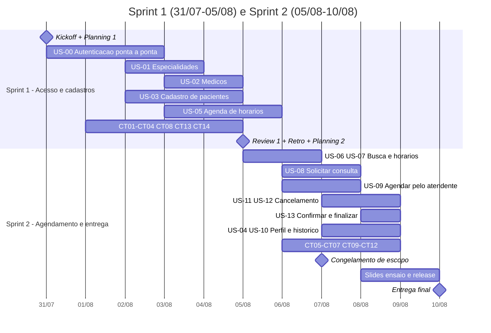

# Cronograma

**Entrega final: segunda-feira, 10/08/2026.**
Primeira reunião: **sexta-feira, 31/07/2026**. A equipe se encontra **segundas, quartas, sextas
e sábados** — nos demais dias o trabalho é assíncrono, com atualização no board.

São **11 dias corridos** entre a primeira reunião e a entrega, com **7 encontros**. O
planejamento abaixo cabe nesse tempo; o escopo foi reduzido exatamente para isso
([ADR-008](adr/ADR-008-rebaseline-escopo.md)).

Ponto de partida: scaffold, Docker, CI, migrações, autenticação de backend e documentação de
arquitetura **já estão prontos**. As sprints começam com o ambiente funcionando.

---

## Calendário

| Data | Dia | Encontro | O que acontece |
|---|---|---|---|
| **31/07** | Sexta | ✅ **Kickoff + Planning 1** | Alinhar rebaseline, distribuir papéis, todos rodam o ambiente, puxar os primeiros itens |
| 01/08 | Sábado | ✅ Sincronização | Desbloquear ambiente, revisar PRs abertos |
| 02/08 | Domingo | — | Assíncrono |
| 03/08 | Segunda | ✅ Sincronização | Meia-sprint: o que está travado? |
| 04/08 | Terça | — | Assíncrono |
| **05/08** | Quarta | ✅ **Review 1 + Retro + Planning 2** | PO valida os critérios de aceite da Sprint 1 |
| 06/08 | Quinta | — | Assíncrono |
| 07/08 | Sexta | ✅ Sincronização | **Congelamento de escopo**: o que não estiver em Code Review sai |
| 08/08 | Sábado | ✅ Sincronização | Ensaio da demonstração; fechar evidências |
| 09/08 | Domingo | — | Ajustes finais, slides |
| **10/08** | Segunda | ✅ **Review 2 + Entrega** | Release `v1.0.0`, apresentação |

---

## Sprint 1 — Acesso e cadastros base

**31/07 (sex) a 05/08 (qua) · 6 dias corridos**

**Meta:** *é possível entrar no sistema com os dois perfis, e o atendente consegue cadastrar
especialidade, médico, paciente e a agenda de horários.*

**User Stories:** US-00, US-01, US-02, US-03, US-05
**Casos de teste:** CT01, CT02, CT03, CT04, CT08, CT13, CT14
**Sessão exploratória:** EXP-01 (cadastros)

| Encontro | Uanderson (PO) | Ronaldo (Backend) | João Vitor (Frontend) | Antonio (Frontend + processo) | Jackson (QA) | Felipe (QA/CI) |
|---|---|---|---|---|---|---|
| **31/07 sex** — Kickoff | Apresentar rebaseline; validar backlog cortado | Rodar ambiente; revisar migração inicial | Rodar ambiente; `AppShell`, tema, layout | Rodar ambiente; `lib/api.ts` e componentes base | Revisar plano de testes com o escopo novo | Validar CI e ativar branch protection |
| **01/08 sáb** | Refinar critérios de US-01/02/03 | US-00 backend: revisar auth pronta e cobrir lacunas | US-00 frontend: tela de login | US-00 frontend: primeiro acesso | Escrever CT01–CT04 | Escrever CT08, CT13, CT14 |
| **03/08 seg** | Validar US-00 na coluna UAT | US-01 + US-02 backend | US-00: guarda de rota por perfil | US-01 frontend: especialidades | Executar CT04 com evidência | EXP-01 (cadastros) |
| **05/08 qua** — Review 1 | **Validar critérios de aceite**; conduzir Retro | US-03 + US-05 backend (RN01, RN02, RN05, RN09) + testes unitários | US-02 frontend: médicos | US-03 frontend: pacientes | Executar CT01–CT03, CT08, CT13 | Executar CT14; consolidar evidências |

**Risco principal:** US-00 bloqueia todo o resto. O backend dela **já existe** — se algo atrasar,
será o frontend. Mitigação: João Vitor e Antonio atacam login e primeiro acesso em paralelo já
no primeiro dia.

---

## Sprint 2 — Agendamento, cancelamento e entrega

**05/08 (qua) a 10/08 (seg) · 5 dias corridos**

**Meta:** *o paciente marca e cancela consulta, o atendente agenda, cancela, confirma e
finaliza — com evidência de teste e release marcada.*

**User Stories:** US-04, US-06, US-07, US-08, US-09, US-10, US-11, US-12, US-13
**Casos de teste:** CT05, CT06, CT07, CT09, CT10, CT11, CT12
**Sessões exploratórias:** EXP-02 (agendamento e concorrência), EXP-03 (cancelamento e 24h)

| Encontro | Uanderson (PO) | Ronaldo (Backend) | João Vitor (Frontend) | Antonio (Frontend + processo) | Jackson (QA) | Felipe (QA/CI) |
|---|---|---|---|---|---|---|
| **05/08 qua** — Planning 2 | Repriorizar carryover; travar ordem de corte | US-06 + US-07 backend (RN03) | Filtro de médicos por especialidade | Grade de horários livres | Revisar matriz de cobertura | Ajustar CI se necessário |
| **07/08 sex** — Congelamento | Validar US-06/07/08; **congelar escopo** | US-08 (`FOR UPDATE`) + US-09 backend | Fluxo de agendamento do paciente | Tela de agendamento do atendente | Executar CT05 | EXP-02 (concorrência) |
| **08/08 sáb** — Ensaio | Revisar documentação; ensaiar demo | US-11 + US-12 (Strategy, RN04) + US-13 backend | Ação de cancelar + badges de status | US-04 e US-10: perfil e histórico | Executar CT06, CT07, CT09, CT10 | EXP-03; executar CT11, CT12 |
| **09/08 dom** — assíncrono | Revisar slides | Fechar cobertura de testes | Polimento e acessibilidade | **Montar slides** | Relatório de execução | Relatório final + print do CI verde |
| **10/08 seg** — Entrega | **Review final** | Release `v1.0.0`; merge em `main` | Apoio na demo | **Apresentação** | Apoio na demo | Apoio na demo |

**Risco principal:** 08 e 09/08 concentram teste, slides e release. Mitigação: o congelamento de
escopo em **07/08** é obrigatório — item que não estiver em *Code Review* nessa data sai do MVP
e vira melhoria futura.

---

## Marcos

| Marco | Quando | Critério objetivo |
|---|---|---|
| Ambiente de todos funcionando | 31/07 | As 6 pessoas abriram `localhost:3000` e `localhost:8000/docs` |
| Branch protection ativa | 31/07 | PR sem `quality-gate` verde não é mergeável |
| Acesso completo | 03/08 | Login e primeiro acesso funcionando nos dois perfis |
| Cadastros base completos | 05/08 | Especialidade, médico, paciente e agenda operacionais pela interface |
| Agendamento completo | 07/08 | Paciente solicita; atendente agenda |
| **Congelamento de escopo** | **07/08** | Nada novo entra; o que está em To Do sai do MVP |
| Ciclo de status completo | 08/08 | Os quatro status da RN06 alcançáveis pela interface |
| Todos os CTs executados | 09/08 | Relatório de execução preenchido com evidência |
| Release `v1.0.0` | 10/08 | Tag criada, `main` atualizada, CI verde |

---

## Capacidade e realismo

**6 pessoas · 11 dias corridos · 7 encontros.**

Estimativa conservadora de **~3h úteis por pessoa por dia** dá cerca de **200h de equipe** nas
duas sprints. Descontando cerimônias (~7h), revisão de PR (~15%) e imprevistos (~20%), sobram
aproximadamente **140h de trabalho efetivo**.

O escopo enxuto — 14 User Stories, com o backend de autenticação já pronto — cabe nessa conta.
Os 82 itens do planejamento anterior não cabiam, e é essa a razão do rebaseline.

**Não planejem 100% da capacidade.** A folga de ~20% é o que absorve o PR que volta na revisão
e o bug que aparece no teste exploratório.

---

## Priorização (se o prazo apertar)

Corte nesta ordem, de baixo para cima. A regra é **cortar a User Story inteira**, nunca entregar
backend sem tela ([ADR-008](adr/ADR-008-rebaseline-escopo.md) §2) — sem fluxo navegável o QA não
produz evidência, e evidência é entregável avaliado.

| Prioridade | User Stories | Justificativa |
|---|---|---|
| **P0 — não corta** | US-00, US-01, US-02, US-03, US-05, US-08, US-11 | Sem isso não há RN01–RN05 demonstrável |
| **P1** | US-07, US-09, US-12, US-13 | Completam a RN06 e o fluxo do atendente |
| **P2 — corta primeiro** | US-04, US-06, US-10 | Importantes, contornáveis na demonstração |

O que for cortado vira item em [`15-melhorias-futuras.md`](15-melhorias-futuras.md) com o motivo
escrito, e entra no slide de retrospectiva.

**Nunca corte:** teste unitário de RN, evidência de caso de teste, ou o job `docker` do CI.
