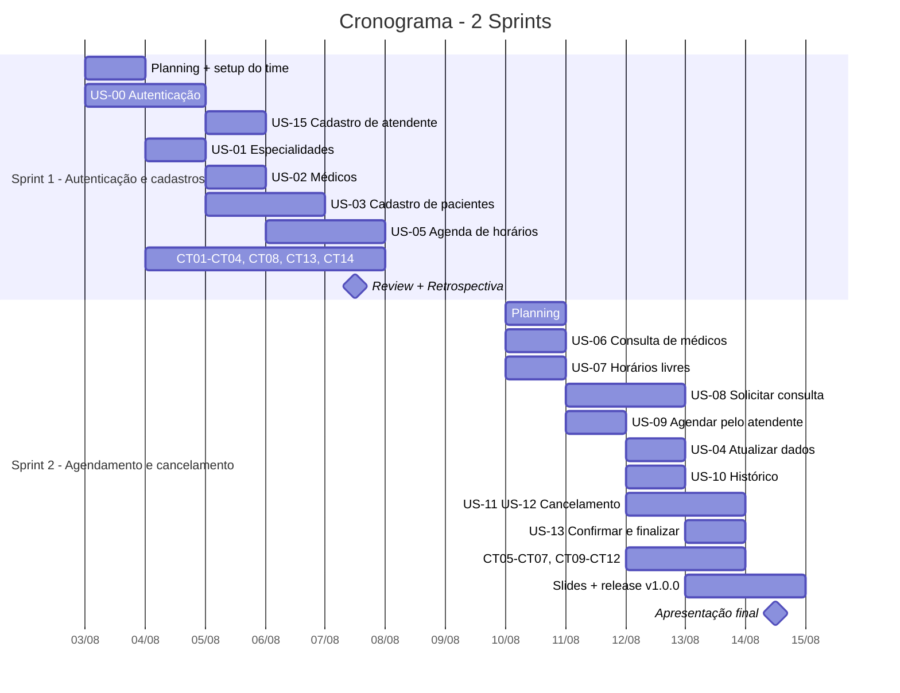

# Cronograma

2 sprints de 5 dias úteis. Base zero: o planejamento, o scaffold, o Docker, o CI e a
documentação de arquitetura já estão prontos — as sprints começam com o ambiente funcionando.

Ajustem as datas na primeira Planning.

---

## Visão geral

---

## Sprint 1 — Autenticação e cadastros base

**Meta:** *ao fim da semana, é possível logar e cadastrar especialidade, médico, paciente e
agenda.*

| Dia | PO-A | PO-B | ENG-A (backend) | ENG-B (frontend) | QA-A | QA-B |
|---|---|---|---|---|---|---|
| **1** Seg | Revisar backlog; validar US-13/14/15 adicionadas | Planning; popular o board | Migração inicial + revisar índice parcial | Layout, tema, `AppShell`, cliente HTTP | Revisar plano de testes | Configurar branch protection + rodar CI |
| **2** Ter | Refinar critérios da US-01/02/03 | Daily; ata | US-00 auth (login, verificar-cpf, vincular-ou-criar) | Tela de login + primeiro acesso | Escrever CT01–CT04 | Escrever CT08, CT13, CT14 |
| **3** Qua | Validar US-00 | Acompanhar WIP | US-15 cadastro de atendente + US-01 especialidades | Guards por perfil; tela de especialidades | Executar CT04 + evidência | EXP-01 (cadastros) |
| **4** Qui | Validar US-01/US-15 | Ata | US-02 médicos + US-03 pacientes (RN01, RN02, RN07) | Formulários de médico e paciente | Executar CT01–CT03 | Executar CT14 |
| **5** Sex | **Review**: validar critérios | **Retrospectiva** + ações | US-05 agenda (RN05, RN09) + testes unitários | Painel de lançamento de agenda | Executar CT08, CT13 | Consolidar evidências Sprint 1 |

**Entregas da sprint:** US-00, US-01, US-02, US-03, US-05, US-15 · CT01–CT04, CT08, CT13, CT14 ·
EXP-01 · CI verde.

**Riscos:** US-00 é a mais complexa (dois caminhos no `vincular-ou-criar`) e bloqueia todo o
resto. Se atrasar, adie US-05 para a Sprint 2 — nunca US-00.

---

## Sprint 2 — Agendamento, cancelamento e entrega

**Meta:** *ciclo completo de agendamento e cancelamento funcionando, com evidências e release
marcada.*

| Dia | PO-A | PO-B | ENG-A (backend) | ENG-B (frontend) | QA-A | QA-B |
|---|---|---|---|---|---|---|
| **6** Seg | Planning; repriorizar carryover | Planning; atualizar board | US-06 + US-07 (RN03) | Tela de médicos com filtro; calendário de horários | Revisar matriz de cobertura | Ajustar CI se necessário |
| **7** Ter | Validar US-06/07 | Daily; ata | US-08 solicitar (`FOR UPDATE`) + US-09 atendente | Fluxo de agendamento (paciente e atendente) | Executar CT05 | EXP-03 (agendamento, concorrência) |
| **8** Qua | Validar US-08/09 | Acompanhar WIP | US-11 + US-12 cancelamento (Strategy, RN04) + US-04 | Ação de cancelar; tela de perfil | Executar CT06, CT07 | Executar CT11, CT12 |
| **9** Qui | Iniciar revisão da documentação | **Montar slides** | US-13 status + US-10 histórico + fechar cobertura | Painel de consultas com badges de status | Executar CT09, CT10 | EXP-04 (cancelamento) |
| **10** Sex | **Review** final; validar tudo | **Apresentação** | Release `v1.0.0`; merge em `main` | Polimento visual; acessibilidade | Relatório de execução | Relatório final + print do CI verde |

**Entregas da sprint:** US-04, US-06 a US-13 · CT05–CT07, CT09–CT12 · EXP-03, EXP-04 ·
slides · tag `v1.0.0`.

**Riscos:** os dias 9–10 concentram documentação, slides e release. Mitigação: US-14 é
*Desejável* e sai primeiro; slides começam no dia 9, não no dia 10.

---

## Marcos

| Marco | Quando | Critério |
|---|---|---|
| Ambiente do time funcionando | Dia 1 | Todos rodaram `make bootstrap` com sucesso |
| Branch protection ativa | Dia 1 | PR sem `quality-gate` verde não é mergeável |
| Autenticação completa | Dia 3 | Login e primeiro acesso funcionando nos dois perfis |
| Cadastros base completos | Dia 5 | Especialidade, médico, paciente e agenda operacionais |
| Agendamento completo | Dia 8 | Paciente solicita; atendente agenda |
| Ciclo completo | Dia 9 | Todos os quatro status alcançáveis |
| Todos os CTs executados | Dia 10 | Relatório de execução preenchido |
| Release `v1.0.0` | Dia 10 | Tag criada, `main` atualizada |

---

## Priorização (se o prazo apertar)

Corte nesta ordem, de baixo para cima:

| Prioridade | Itens | Justificativa |
|---|---|---|
| **P0 — não corta** | US-00, US-01, US-02, US-03, US-05, US-08, US-11 | Sem isso não há RN01–RN05 demonstrável |
| **P1** | US-09, US-12, US-13, US-07 | Completam RN06 e o fluxo do atendente |
| **P2** | US-04, US-06, US-10, US-15 | Importantes, mas contornáveis na demo |
| **P3 — corta primeiro** | US-14 agenda geral, refinamentos visuais, tarefas `[DESEJÁVEL]` | Não afetam nenhuma RN obrigatória |

Nunca corte: teste unitário de RN, evidência de CT, ou o job `docker` do CI. É o que a
avaliação examina.

---

## Capacidade

4 pessoas em desenvolvimento (ENG-A, ENG-B, QA-A, QA-B) + 2 em PO/processo.
5 dias × ~6h úteis = **~30h por pessoa por sprint**, descontando cerimônias
(~2h/semana) e imprevistos.

Não planejem 100% da capacidade. Deixem ~20% de folga: no case da plataforma educacional do
material, planejar tudo cheio foi o que gerou o retrabalho.
